# CARRERA DE CAMIONES - JUEGO DE AZAR
## VERSION ACTUAL:
3.1.1

## VERSION 3.0

> **Warning**: use Colorama > Colorama-0.4.6 (**pip install -r requirements.txt**)!

Proyecto de práctica de instancias aprendidas.
Comencé este juego para divertirme, inicialmente mediante strings y slicing.
La idea principal era esforzarme por aplicar lo aprendido en clase de forma independiente y fuera de los ejercicios establecidos.
A medida que pasaban los meses, fui actualizando las versiones y refactorizando el código para mejorar su funcionamiento.
Se publica a partir de la versión 3.0, que es la más completa hasta el momento, repasando mayoritariamente mi recorrido en Python.
A medida que mi creatividad lo permita, seguiré actualizando versiones con nuevas funcionalidades o refactorización de código.

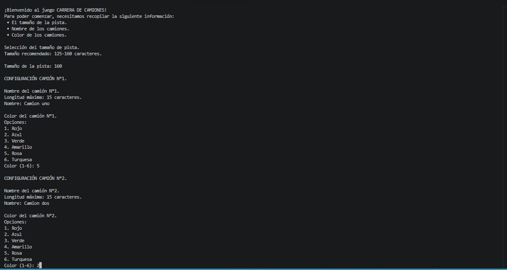
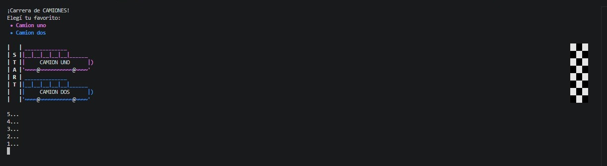
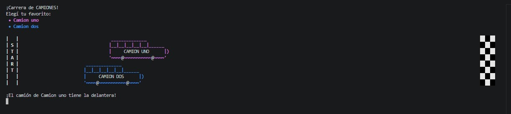
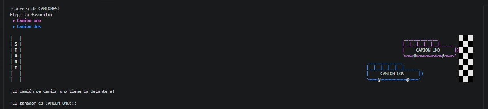


## REQUERIMENTS

>
> ```sh
> Python 3.13.7
> python -m venv env
> .\env\Scripts\Activate
> pip install -r requirements.txt
> ```
>

## RUN FILE

main.py

## VERSION 3.1
### Seleccionar favorito

Se agrega la posibilidad de que un usuario registre de antemano qué camión cree que va a ganar.
Se muestra por pantalla durante el proceso y se determina con el resultado final.

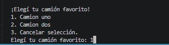
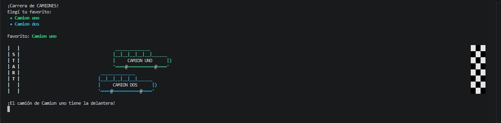
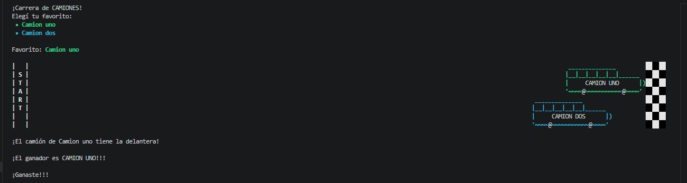

## VERSION 3.1.1
### Seleccionar múltiples favoritos

Se agrega la posibilidad de determinar cuántas personas van a elegir favoritos
Al final, se calcula e imprime la totalidad de ganadores

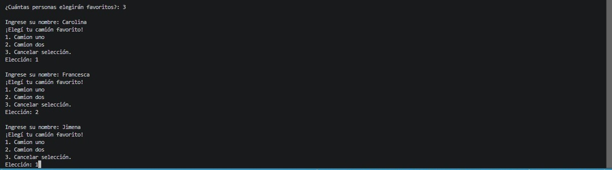
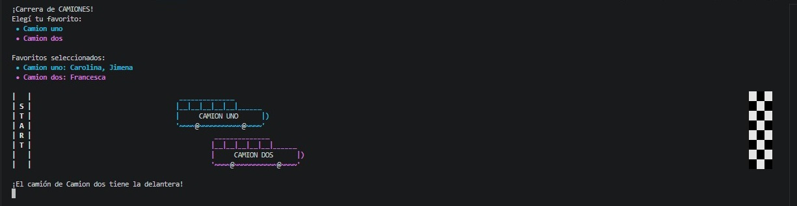
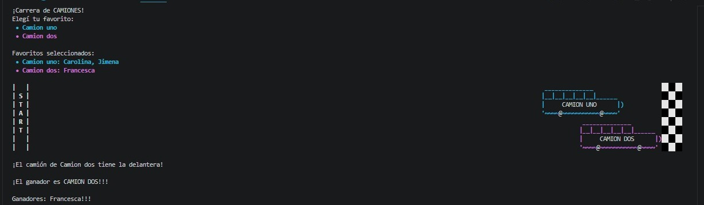


## VERSION 3.2
### Guardar resultados y calcular TOP 3

Se agrega la funcionalidad que guarda en un .csv los favoritos registrados
Al final, calcula del csv el TOP 3 con los mayores aciertos y lo imprime por pantalla

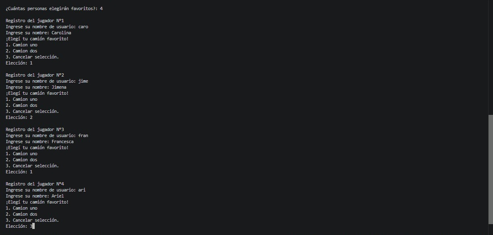
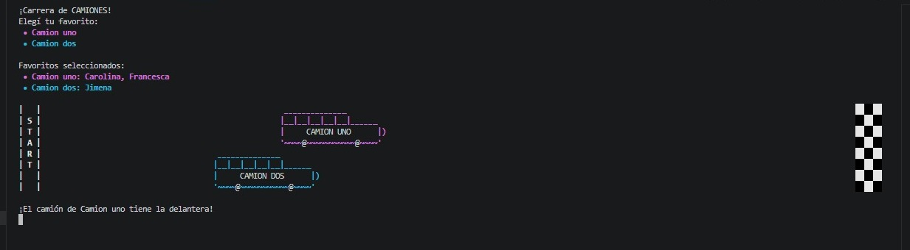
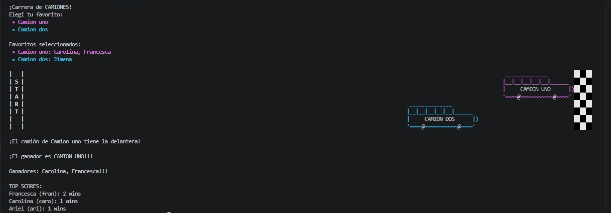
